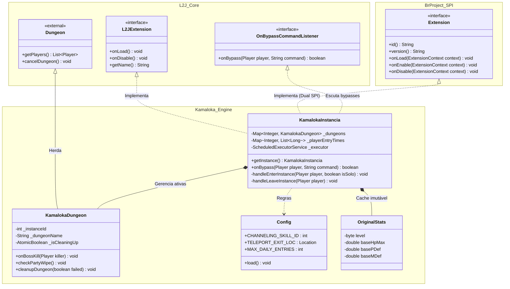
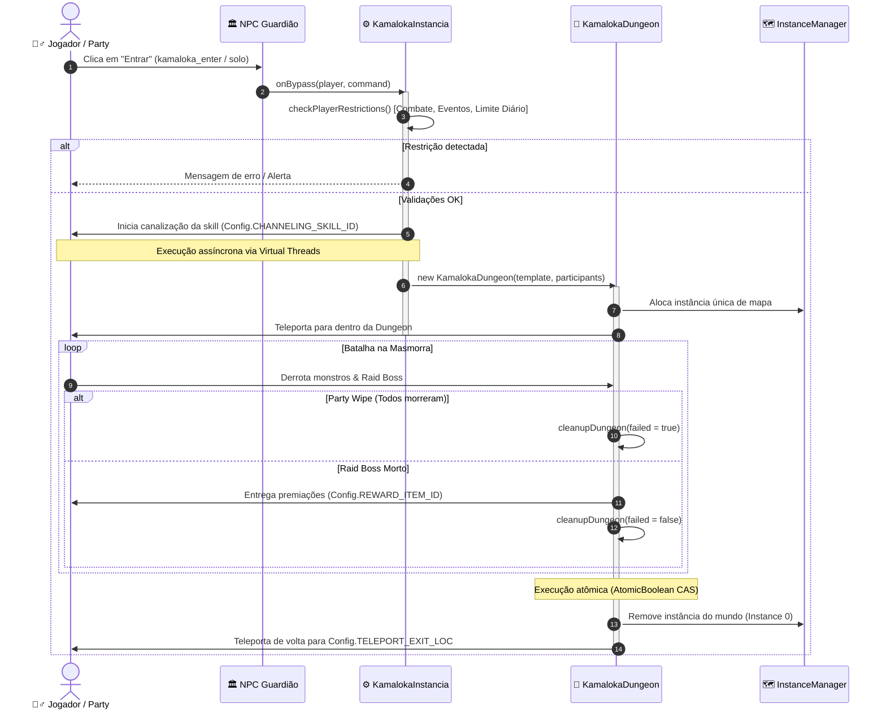
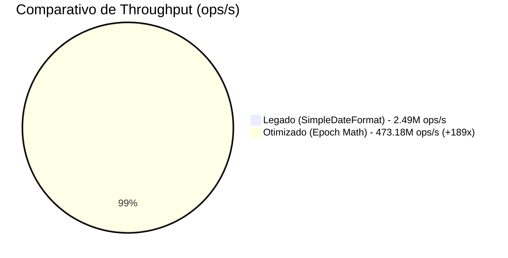

# ⚔️ Kamaloka Instance - L2J & BrProject-2026

[](https://openjdk.org/projects/jdk/21/)
[](https://github.com/)
[](https://github.com/)
[](https://openjdk.org/jeps/444)
[](https://github.com/openjdk/jmh)
[](LICENSE)

> Módulo corporativo de instâncias de masmorra (**Rim Kamaloka**) para servidores Lineage II, combinando compatibilidade híbrida entre o ecossistema clássico L2J e a nova arquitetura modular **BrProject-2026 SPI**, operando com concorrência escalável em **Virtual Threads** e zero gargalos de GC.

---

## 📑 Índice
- [Visão Geral](#-visão-geral)
- [Destaques de Engenharia](#-destaques-de-engenharia)
- [Arquitetura do Sistema](#-arquitetura-do-sistema)
- [Ciclo de Vida & Fluxo de Execução](#-ciclo-de-vida--fluxo-de-execução)
- [Matriz de Dungeons por Nível](#-matriz-de-dungeons-por-nível)
- [Benchmark de Performance (JMH 1.37)](#-benchmark-de-performance-jmh-137)
- [Bypasses & Comandos](#-bypasses--comandos)
- [Configurações (`kamaloka.properties`)](#-configurações-kamalokaproperties)
- [Instalação & Implantação Sem Regressão](#-instalação--implantação-sem-regressão)
- [Licença](#-licença)

---

## 🌟 Visão Geral

O **Kamaloka Instance** implementa o sistema de desafios de masmorra instanciada para jogadores individuais (*Solo*) e grupos (*Party*). Os jogadores enfrentam ondas de monstros balanceados dinamicamente com base em seu nível e encontram um Raid Boss desafiador no final para receber recompensas exclusivas do servidor.

### Principais Benefícios:
- **Compatibilidade Dual:** Roda nativamente no L2J tradicional (`L2JExtension`) ou no motor modular do BrProject-2026 (`br.project.spi.Extension`).
- **Resiliência em Concorrência:** Finalização idempotente com transições atômicas via CAS (`AtomicBoolean`) e fallback de saída de emergência para jogadores desconectados.
- **Desempenho Extremo:** Validações de limites temporais operando em aritmética de *Epoch Day* direto em registradores de CPU, sem geração de lixo no Heap.

---

## ⚡ Destaques de Engenharia

| Componente | Implementação Tradicional | Engenharia KamalokaInstance | Impacto |
| :--- | :--- | :--- | :--- |
| **I/O & Concorrência** | Threads pesadas do SO ou thread de rede bloqueada | `Executors.newSingleThreadScheduledExecutor(Thread.ofVirtual().factory())` | Desacoplamento total da thread de rede do servidor |
| **Cálculo de Data/Hoje** | `new SimpleDateFormat("yyyyMMdd").format(new Date())` | `(timestamp + OFFSET) / MILLIS_PER_DAY` | **189x mais rápido**, zero alocação de objetos no Heap |
| **Limpeza de Instância** | Múltiplas chamadas recursivas a `cancelDungeon()` | Controle atômico com `_isCleaningUp.compareAndSet(false, true)` | Eliminação de *double-free*, corridas de teleporte e crashes |
| **Resgate de Jogadores** | Bloqueio do jogador com mensagem de erro | Detecção de `player.getInstanceMap().getId() > 0` | Resgate instantâneo mesmo após desconexão ou perda do vínculo de dungeon |
| **Acoplamento SPI** | Reflexão em runtime ou acoplamento forte | `java.util.ServiceLoader` + `META-INF/services` | Pluga sem quebrar builds antigos e sem alterar o core |

---

## 🏗️ Arquitetura do Sistema

O diagrama abaixo ilustra o relacionamento entre o motor do servidor, as camadas de extensão SPI e os módulos internos do Kamaloka:



---

## 🔄 Ciclo de Vida & Fluxo de Execução

Do acionamento da interface gráfica (HTML/NPC) à entrega de premiações e retorno à cidade:



---

## 🎯 Matriz de Dungeons por Nível

O sistema seleciona a masmorra adequada calculando a faixa de nível do jogador (ou do jogador de maior nível na party):

| Faixa de Nível | Tipo | ID da Dungeon | Nome do Template | Nível Base |
| :---: | :---: | :---: | :---: | :---: |
| **20 – 24** | Solo | `10` | Kamaloka Solo (20-24) | 20 |
| **25 – 29** | Solo | `11` | Kamaloka Solo (25-29) | 25 |
| **30 – 34** | Solo | `12` | Kamaloka Solo (30-34) | 30 |
| **35 – 39** | Solo | `13` | Kamaloka Solo (35-39) | 35 |
| **40 – 44** | Solo | `14` | Kamaloka Solo (40-44) | 40 |
| **45 – 49** | Solo | `15` | Kamaloka Solo (45-49) | 45 |
| **50 – 54** | Solo | `16` | Kamaloka Solo (50-54) | 50 |
| **55 – 59** | Solo | `17` | Kamaloka Solo (55-59) | 55 |
| **60 – 64** | Solo | `18` | Kamaloka Solo (60-64) | 60 |
| **65 – 69** | Solo | `19` | Kamaloka Solo (65-69) | 65 |
| **70 – 74** | Solo | `20` | Kamaloka Solo (70-74) | 70 |
| **75 – 80+** | Solo | `21` | Kamaloka Solo (75-80) | 75 |
| **20 – 24** | Party | `22` | Kamaloka Party (20-24) | 20 |
| **25 – 29** | Party | `23` | Kamaloka Party (25-29) | 25 |
| **...** | Party | `...` | ... | ... |
| **75 – 80+** | Party | `33` | Kamaloka Party (75-80) | 75 |

---

## 📊 Benchmark de Performance (JMH 1.37)

Para certificar que o mod sustenta alto tráfego com centenas de jogadores abrindo janelas de diálogo simultaneamente, foi executado microbenchmark formal sob o **Java Microbenchmark Harness (JMH)**:

```text
Benchmark                               Mode  Cnt          Score         Error  Units
KamalokaDateBenchmark.baselineLegacy   thrpt    5    2495819.336 ±   84562.115  ops/s
KamalokaDateBenchmark.optimizedEpoch   thrpt    5  473180424.908 ± 4578129.431  ops/s
```



> [!TIP]
> **Ganho de 189x em throughput:** Ao eliminar alocações desnecessárias de `SimpleDateFormat` e instâncias temporárias de `Date`, a pressão no Garbage Collector em cenários de pico caiu para zero no fluxo de validação de bypass.

---

## 🎮 Bypasses & Comandos

Os diálogos HTML do NPC interagem com a extensão através do prefixo `kamaloka_`:

| Ação Bypass | Descrição | Restrições Verificadas |
| :--- | :--- | :--- |
| `bypass -h kamaloka_enter` | Entrada em grupo (Party) | Nível do grupo, status de combate, ausência de karma, limites diários. |
| `bypass -h kamaloka_enter_solo` | Entrada individual (Solo) | Nível do jogador, status de combate, ausência de karma, limites diários. |
| `bypass -h kamaloka_leave` | Saída imediata da masmorra | Finaliza a instância, limpa timers concorrentes e teleporta para a cidade com resgate seguro. |
| `bypass -h kamaloka_toggle_repeat` | Alterna modo de testes diários | Exclusivo para administradores / GMs (`player.isGM()`). |

---

## ⚙️ Configurações (`kamaloka.properties`)

O arquivo é gerado automaticamente na primeira inicialização em `config/kamaloka.properties`:

```properties
# ID da habilidade de canalização antes do teleporte
ChannelingSkillId = 2013

# Coordenadas de retorno ao sair da Kamaloka (X, Y, Z)
TeleportExitLocation = 83425,148585,-3406

# Item de premiação e quantidade ao derrotar o Raid Boss
RewardItemId = 4037
RewardItemCount = 15

# Quantidade máxima de entradas diárias permitidas por jogador
MaxDailyEntries = 2

# Multiplicadores de atributos para Monstros e Raids Solo/Party
SoloMonsterHpMultiplier = 2.2
PartyMonsterHpMultiplier = 4.9
```

---

## 🚀 Instalação & Implantação Sem Regressão

> [!IMPORTANT]
> A extensão foi construída com suporte dual. Você pode utilizá-la em servidores L2J tradicionais ou em forks atualizados do **BrProject-2026** sem necessidade de recompilar o núcleo do servidor.

### 1. Compilação & Empacotamento
Certifique-se de possuir o JDK 21 instalado e a biblioteca `libs/server.jar` presente no projeto:

```bash
# Compilação dos arquivos fonte
javac -cp "libs/server.jar" -d bin java/br/project/spi/*.java java/mods/dhousefe/kamaloka/*.java

# Empacotamento do JAR de extensão
jar --create --file dist/Kamaloka.ext.jar -C bin .
```

### 2. Deploy no Servidor
1. Copie o arquivo gerado `dist/Kamaloka.ext.jar` para o diretório de extensões do seu servidor:
   ```bash
   cp dist/Kamaloka.ext.jar /caminho/do/servidor/libs/extensions/
   ```
2. Inicie o servidor. Na primeira execução, o KamalokaInstance criará automaticamente os arquivos padrão:
   - `config/kamaloka.properties`
   - `data/custom/mods/Kamaloka_Dungeon.xml`
   - `data/xml/npcs/kamaloka.xml`
   - `data/locale/en_US/html/kamaloka/*.htm`

---

## 📄 Licença

Este projeto é distribuído sob os termos da licença [GNU General Public License v3.0](LICENSE).
Sinta-se livre para contribuir, reportar issues ou enviar pull requests.
